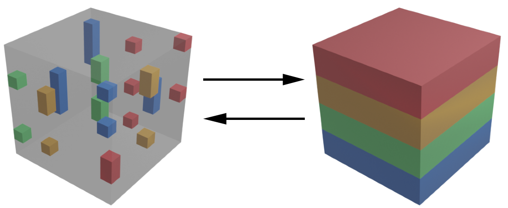

[](https://github.com/eth-cscs/SpFFT/actions?query=workflow%3ACI)
[](https://spfft.readthedocs.io/en/latest/?badge=latest)
[](https://raw.githubusercontent.com/eth-cscs/SpFFT/master/LICENSE)

# SpFFT
SpFFT - A 3D FFT library for sparse frequency domain data written in C++ with support for MPI, OpenMP, CUDA and ROCm.

Inspired by the need of some computational material science applications with spherical cutoff data in frequency domain, SpFFT provides Fast Fourier Transformations of sparse frequency domain data. For distributed computations with MPI, slab decomposition in space domain and pencil decomposition in frequency domain (sparse data within a pencil / column must be on one rank) is used.



***Fig. 1:*** Illustration of a transform, where data on each MPI rank is identified by color.

### Design Goals
- Sparse frequency domain input
- Reuse of pre-allocated memory
- Support for shifted indexing with centered zero-frequency
- Optional parallelization and GPU acceleration
- Unified interface for calculations on CPUs and GPUs
- Support of Complex-To-Real and Real-To-Complex transforms, where the full hermitian symmetry property is utilized
- C++, C and Fortran interfaces

### Interface Design
To allow for pre-allocation and reuse of memory, the design is based on two classes:

- **Grid**: Provides memory for transforms up to a given size.
- **Transform**: Created with information on sparse input data and is associated with a *Grid*. Maximum size is limited by *Grid* dimensions. Internal reference counting to *Grid* objects guarantee a valid state until *Transform* object destruction.

The user provides memory for storing sparse frequency domain data, while a *Transform* provides memory for space domain data. This implies, that executing a *Transform* will override the space domain data of all other *Transforms* associated with the same *Grid*.

## Documentation
Documentation can be found [here](https://spfft.readthedocs.io/en/latest/).

## Requirements
- C++ Compiler with C++11 support. Supported compilers are:
  - GCC 6 and later
  - Clang 5 and later
  - ICC 18.0 and later
- CMake 3.11 and later
- Library providing a FFTW 3.x interface (FFTW3 or Intel MKL)
- For multi-threading: OpenMP support by the compiler
- For compilation with GPU support:
  - CUDA 9.0 and later for Nvidia hardware
  - ROCm 3.5 and later for AMD hardware

## Installation
The build system follows the standard CMake workflow. Example:
```console
mkdir build
cd build
cmake .. -DSPFFT_OMP=ON -DSPFFT_MPI=ON -DSPFFT_GPU_BACKEND=CUDA -DSPFFT_SINGLE_PRECISION=OFF -DCMAKE_INSTALL_PREFIX=/usr/local
make -j8 install
```

### CMake options
| Option                 | Default | Description                                      |
|------------------------|---------|--------------------------------------------------|
| SPFFT_MPI              | ON      | Enable MPI support                               |
| SPFFT_OMP              | ON      | Enable multi-threading with OpenMP               |
| SPFFT_GPU_BACKEND      | OFF     | Select GPU backend. Can be OFF, CUDA or ROCM     |
| SPFFT_GPU_DIRECT       | OFF     | Use GPU aware MPI with GPUDirect                 |
| SPFFT_SINGLE_PRECISION | OFF     | Enable single precision support                  |
| SPFFT_STATIC           | OFF     | Build as static library                          |
| SPFFT_BUILD_TESTS      | OFF     | Build test executables for developement purposes |
| SPFFT_INSTALL          | ON      | Add library to install target                    |
| SPFFT_FORTRAN          | OFF     | Build Fortran interface module                   |


## Examples
Further exmples for C++, C and Fortran can be found in the "examples" folder.
```cpp
#include <complex>
#include <iostream>
#include <vector>

#include "spfft/spfft.hpp"

int main(int argc, char** argv) {
  const int dimX = 2;
  const int dimY = 2;
  const int dimZ = 2;

  std::cout << "Dimensions: x = " << dimX << ", y = " << dimY << ", z = " << dimZ << std::endl
            << std::endl;

  // Use default OpenMP value
  const int numThreads = -1;

  // use all elements in this example.
  const int numFrequencyElements = dimX * dimY * dimZ;

  // Slice length in space domain. Equivalent to dimZ for non-distributed case.
  const int localZLength = dimZ;

  // interleaved complex numbers
  std::vector<double> frequencyElements;
  frequencyElements.reserve(2 * numFrequencyElements);

  // indices of frequency elements
  std::vector<int> indices;
  indices.reserve(dimX * dimY * dimZ * 3);

  // initialize frequency domain values and indices
  double initValue = 0.0;
  for (int xIndex = 0; xIndex < dimX; ++xIndex) {
    for (int yIndex = 0; yIndex < dimY; ++yIndex) {
      for (int zIndex = 0; zIndex < dimZ; ++zIndex) {
        // init with interleaved complex numbers
        frequencyElements.emplace_back(initValue);
        frequencyElements.emplace_back(-initValue);

        // add index triplet for value
        indices.emplace_back(xIndex);
        indices.emplace_back(yIndex);
        indices.emplace_back(zIndex);

        initValue += 1.0;
      }
    }
  }

  std::cout << "Input:" << std::endl;
  for (int i = 0; i < numFrequencyElements; ++i) {
    std::cout << frequencyElements[2 * i] << ", " << frequencyElements[2 * i + 1] << std::endl;
  }

  // create local Grid. For distributed computations, a MPI Communicator has to be provided
  spfft::Grid grid(dimX, dimY, dimZ, dimX * dimY, SPFFT_PU_HOST, numThreads);

  // create transform
  spfft::Transform transform =
      grid.create_transform(SPFFT_PU_HOST, SPFFT_TRANS_C2C, dimX, dimY, dimZ, localZLength,
                            numFrequencyElements, SPFFT_INDEX_TRIPLETS, indices.data());

  // Get pointer to space domain data. Alignment fullfills requirements for std::complex.
  // Can also be read as std::complex elements (guaranteed by the standard to be binary compatible
  // since C++11).
  double* spaceDomain = transform.space_domain_data(SPFFT_PU_HOST);

  // transform backward
  transform.backward(frequencyElements.data(), SPFFT_PU_HOST);

  std::cout << std::endl << "After backward transform:" << std::endl;
  for (int i = 0; i < transform.local_slice_size(); ++i) {
    std::cout << spaceDomain[2 * i] << ", " << spaceDomain[2 * i + 1] << std::endl;
  }

  // transform forward
  transform.forward(SPFFT_PU_HOST, frequencyElements.data(), SPFFT_NO_SCALING);

  std::cout << std::endl << "After forward transform (without scaling):" << std::endl;
  for (int i = 0; i < numFrequencyElements; ++i) {
    std::cout << frequencyElements[2 * i] << ", " << frequencyElements[2 * i + 1] << std::endl;
  }

  return 0;
}
```

## Acknowledgements
This work was supported by:


| | [**Swiss Federal Institute of Technology in Zurich**](https://www.ethz.ch/) |
|:----:|:----:|
| | [**Swiss National Supercomputing Centre**](https://www.cscs.ch/)            |
|  | [**MAterials design at the eXascale**](http://www.max-centre.eu) <br> (Horizon2020, grant agreement MaX CoE, No. 824143) |
